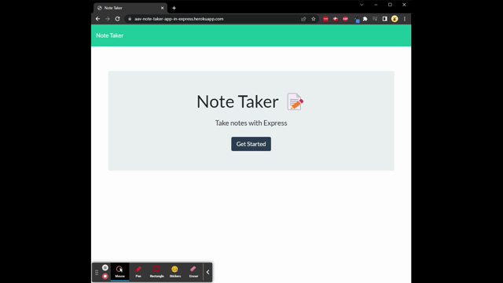

# Note Taker Application in Express.js

## Description

This project provides the user with a note taking web application. The application uses the express.js npm package to build and handle the server. It is deployed to heroku for live usage.

---

## Table of Contents

- [Usage](#usage)
- [Contributing](#contributing)
- [Tests](#tests)
- [Demo](#demo)
- [License](#license)
- [Questions](#questions)

---

## Usage

Visit the deployed application at [aav-note-taker-app-in-express.herokuapp.com](https://aav-note-taker-app-in-express.herokuapp.com/).

When the user clicks the "Get Started" button, the user is presented with another page that contains two fields (1): Note Title and (2): Note Text, a list of previously saved notes, and a new notes button.

When data is entered into both fields, the user is presented with a save button. When the save button is pressed, the note is saved to the database and displayed in the list with previously saved notes.

The list of notes has two clickable areas (1): the note title text and (2): a delete button.

When the note title text is clicked, the full note (both title and text) are displayed on the right hand side of the application. When the delete button is clicked, the note is removed from the database and the saved notes list.

At any point if the new notes button is clicked, the note fields are cleared and the user is able to enter a new note title and text.

---

## Tests

No test scripts have been developed for this application.

---

## Demo

A .gif demo of the deployed application is below.

---

## License

This project is licensed under a [MIT License](https://opensource.org/licenses/MIT).

---

## Questions

Check out my [GitHub profile](https://github.com/aavillanueva6).

For additional questions about this project, please reach out to me at <aavillanueva6@gmail.com>
